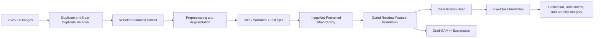

<div align="center">

# 🔬 MaxViT-Tiny-GRFM

## Explainable Histopathology Classification with Gated Residual Feature Modulation

<p>
  <strong>
    A research framework for lung and colon histopathology classification using duplicate-aware dataset preparation, an ImageNet-pretrained MaxViT-Tiny backbone, Gated Residual Feature Modulation, reliability analysis, robustness evaluation, and Grad-CAM++ explainability.
  </strong>
</p>

<p>
  
  
  
  
  
  
  
</p>

<p>
  <b>Histopathology</b> •
  <b>MaxViT</b> •
  <b>GRFM</b> •
  <b>Calibration</b> •
  <b>Robustness</b> •
  <b>Explainable AI</b>
</p>

</div>

## Contributors

- Ashikuzzaman
- Dr. Israt Jhahan Mim
- Md. Meherab Hossain
- Nazmul Hasan Jubair
- Dr. Tania Islam
- Dr. Jia Uddin
- Dr. Abdulrahman S. Alturki

## 🌟 Overview

**MaxViT-Tiny-GRFM** is an explainable deep learning framework for five-class lung and colon histopathology classification using the LC25000 dataset.

The framework extends an ImageNet-pretrained MaxViT-Tiny backbone with **Gated Residual Feature Modulation (GRFM)**. The proposed module adaptively refines extracted visual features through learnable gating and residual transformation while preserving the original representation.

The research objective is to move beyond accuracy-only evaluation by jointly studying:

- Classification performance.
- Calibration and reliability.
- Cross-validation stability.
- Multi-seed reproducibility.
- Robustness under image corruptions.
- Explainability of model decisions.
- Computational efficiency.

> 📄 The associated manuscript has been submitted to an academic conference and is currently **under review**. The reported results correspond to the submitted research work and may be revised after peer review.

> ⚠️ This repository is intended for research and educational purposes. It is not a medical diagnostic system and must not be used for clinical decision-making.

## ✨ Highlights

<table>
<tr>
<td width="50%">

### 🧠 Model Design

- ImageNet-pretrained MaxViT-Tiny.
- Gated Residual Feature Modulation.
- Five-class lung and colon classification.
- 224 × 224 image input.
- Full-network fine-tuning.
- Cross-entropy with label smoothing.

</td>
<td width="50%">

### 🔬 Reliability Evaluation

- Duplicate-aware data preparation.
- Unseen test-set evaluation.
- Three-fold cross-validation.
- Three-seed stability analysis.
- Calibration and confidence intervals.
- Corruption robustness testing.
- Grad-CAM++ explanations.

</td>
</tr>
</table>

## 🧠 Research Workflow



## 🏗️ Architecture

```text
Histopathology Image
        ↓
Image Preprocessing
        ↓
ImageNet-Pretrained MaxViT-Tiny
        ↓
Gated Residual Feature Modulation
        ↓
Dropout and Classification Head
        ↓
Five-Class Prediction
        ↓
Grad-CAM++ Visual Explanation
```

### Model components

| Component | Configuration |
|---|---|
| Backbone | ImageNet-pretrained MaxViT-Tiny |
| Input | 3 × 224 × 224 |
| Feature module | Gated Residual Feature Modulation |
| Classifier | Fully connected classification head |
| Number of classes | 5 |
| Regularization | Dropout and label smoothing |
| Explanation | Grad-CAM++ and gradient-based visualization |

## 📚 Dataset

The experiments use the **LC25000 Lung and Colon Histopathological Image Dataset**.

### Dataset source

[Kaggle — LC25000 Dataset](https://www.kaggle.com/datasets/javaidahmadwani/lc25000)

### Dataset classes

| Class | Description |
|---|---|
| `colon_aca` | Colon adenocarcinoma |
| `colon_n` | Non-malignant colon tissue |
| `lung_aca` | Lung adenocarcinoma |
| `lung_n` | Non-malignant lung tissue |
| `lung_scc` | Lung squamous cell carcinoma |

### Dataset preparation summary

| Property | Value |
|---|---:|
| Original images | 22,501 |
| Images after duplicate-aware cleaning | 20,050 |
| Selected images | 3,007 |
| Number of classes | 5 |
| Image resolution | 224 × 224 |

### Final split

| Split | Images | Percentage |
|---|---:|---:|
| Training | 2,404 | 80% |
| Validation | 298 | 10% |
| Test | 305 | 10% |
| **Total** | **3,007** | **100%** |

The data pipeline removes duplicate or highly similar images before splitting to reduce data leakage and provide a more reliable evaluation.

## 🧪 Preprocessing and Augmentation

### Preprocessing

| Setting | Configuration |
|---|---|
| Resize | 224 × 224 |
| Image format | RGB |
| Normalization | ImageNet mean and standard deviation |
| Dataset split | Stratified train/validation/test split |
| Validation/test augmentation | Disabled |

### Training augmentation

Training-only augmentation includes randomly selected transformations such as:

- Horizontal and vertical flipping.
- Rotation.
- Zooming.
- Brightness adjustment.
- Gaussian noise.
- Color and spatial transformations.

The validation and test images are kept free from training augmentation during evaluation.

## ⚙️ Training Configuration

| Setting | Configuration |
|---|---|
| Input size | 224 × 224 pixels |
| Number of classes | 5 |
| Initialization | ImageNet-pretrained weights |
| Fine-tuning | Full-network fine-tuning |
| Maximum epochs | 35 |
| Batch size | 16 |
| Data-loader workers | 2 |
| Optimizer | AdamW |
| Learning rate | 2 × 10⁻⁵ |
| Weight decay | 1 × 10⁻⁴ |
| Loss | Cross-Entropy with 0.10 label smoothing |
| Gradient clipping | Maximum norm = 1.0 |
| Scheduler | ReduceLROnPlateau |
| Scheduler factor | 0.5 |
| Scheduler patience | 2 epochs |
| Minimum learning rate | 1 × 10⁻⁷ |
| Early stopping patience | 7 epochs |
| Mixed precision | Enabled with CUDA |
| Checkpoint criterion | Best validation macro F1-score |

## 🏆 Results

### Comparative test-set performance

The final evaluation was performed on an unseen test set containing 305 images.

| Model | Accuracy | Precision | Recall | F1-score |
|---|---:|---:|---:|---:|
| Swin-Tiny | 0.8131 | 0.8123 | 0.8131 | 0.8111 |
| DeiT-Tiny | 0.9311 | 0.9347 | 0.9310 | 0.9318 |
| MaxViT | 0.9707 | 0.9791 | 0.9768 | 0.9770 |
| **Proposed MaxViT-Tiny-GRFM** | **0.9967** | **0.9968** | **0.9968** | **0.9967** |

The proposed model correctly classified **304 of 305** test images.

### Reliability and calibration

| Metric | Value |
|---|---:|
| MCC | 0.9959 |
| Cohen's Kappa | 0.9959 |
| Macro Sensitivity | 0.9968 |
| Macro Specificity | 0.9992 |
| Brier Score | 0.0064 |
| ECE | 0.0032 |
| Accuracy 95% CI | [0.9982, 1.0000] |
| Macro F1 95% CI | [0.9898, 1.0000] |

## 🔁 Cross-Validation and Stability

### Three-fold cross-validation

| Fold | Accuracy | Macro F1 |
|---|---:|---:|
| 1 | 0.9971 | 0.9971 |
| 2 | 0.9983 | 0.9983 |
| 3 | 0.9983 | 0.9983 |
| **Mean ± SD** | **0.9979 ± 0.0007** | **0.9979 ± 0.0007** |

### Three-seed stability analysis

| Seed | Accuracy | Macro F1 |
|---|---:|---:|
| 42 | 1.0000 | 1.0000 |
| 123 | 1.0000 | 1.0000 |
| 2024 | 0.9902 | 0.9902 |
| **Mean ± SD** | **0.9967 ± 0.0057** | **0.9967 ± 0.0057** |

## 🛡️ Robustness under Image Corruptions

| Corruption | Mean Accuracy | Worst Accuracy |
|---|---:|---:|
| Gaussian noise | 0.8715 | 0.7639 |
| Salt-and-pepper noise | 0.9370 | 0.8361 |
| Speckle noise | 0.8505 | 0.7738 |
| Gaussian blur | 0.8708 | 0.6393 |
| Motion blur | 0.8977 | 0.7508 |
| Darkening | 0.9954 | 0.9902 |
| Brightening | 0.9161 | 0.7934 |
| Reduced contrast | 0.9836 | 0.9410 |
| JPEG compression | 0.9384 | 0.8000 |
| Occlusion | 0.9961 | 0.9934 |

The model remains particularly stable under darkening, occlusion, reduced contrast, and JPEG compression. Noise and blur produce larger performance reductions.

## 🔍 Explainable AI

The framework uses **Grad-CAM++** and gradient-based visualization to inspect the regions influencing predictions.

The explanation analysis investigates whether the model focuses on meaningful histopathological structures such as:

- Cellular clusters.
- Glandular structures.
- Nuclear regions.
- Tissue boundaries.
- Morphological patterns related to malignancy.

The associated manuscript includes visual examples comparing the original image, backbone activation, GRFM-refined features, Grad-CAM++ maps, and gradient-based saliency maps.

> Explainability maps describe model behavior; they do not constitute clinical evidence or diagnostic proof.

## 🧪 GRFM Ablation Study

| Variant | Accuracy | Macro F1 |
|---|---:|---:|
| MaxViT-Tiny without GRFM | 0.9738 | 0.9736 |
| **MaxViT-Tiny with GRFM** | **0.9967** | **0.9967** |

The GRFM module improved accuracy by approximately **2.29 percentage points** and macro F1-score by approximately **2.31 percentage points** compared with the model without GRFM.

## ⚡ Computational Efficiency

| Measure | Value |
|---|---:|
| Trainable parameters | 31,458,381 |
| Estimated parameter size | 120.29 MB |
| Estimated MACs | 5.33 GMACs |
| Estimated FLOPs | 10.67 GFLOPs |
| Training time | Approximately 35.45 minutes |
| Batch size | 16 |
| End-to-end inference latency | Approximately 4.24 ms/image |
| End-to-end throughput | Approximately 235.89 images/second |

## 🆚 Baseline Models

The proposed framework is compared with compact transformer-based models under the same dataset split and training protocol:

- Swin-Tiny.
- DeiT-Tiny.
- MaxViT.

## 📁 Repository Structure

```text
Histopathology-Classification/
│
├── Lung_histo.pdf
│   └── Submitted conference manuscript
│
├── pmvdcode.ipynb
│   ├── Dataset preparation
│   ├── Duplicate-aware processing
│   ├── Preprocessing and augmentation
│   ├── MaxViT-Tiny-GRFM training
│   ├── Test-set evaluation
│   ├── Calibration analysis
│   ├── Robustness evaluation
│   └── Grad-CAM++ explainability
│
├── pmvdcode (1).ipynb
│   └── Additional experimental workflow
│
└── README.md
```

## 🚀 Quick Start

### 1. Clone the repository

```bash
git clone https://github.com/Ashikuzzaman026/Histopathology-Classification.git
cd Histopathology-Classification
```

### 2. Create an environment

```bash
python -m venv .venv
```

Linux/macOS:

```bash
source .venv/bin/activate
```

Windows:

```bash
.venv\Scripts\activate
```

### 3. Install dependencies

```bash
pip install torch torchvision timm numpy pandas scipy scikit-learn matplotlib tqdm pillow opencv-python scikit-image
```

### 4. Download the dataset

Download the LC25000 dataset from Kaggle:

```text
https://www.kaggle.com/datasets/javaidahmadwani/lc25000
```

### 5. Run the notebooks

Open the notebooks using Jupyter or Google Colab:

```text
pmvdcode.ipynb
pmvdcode (1).ipynb
```

Recommended execution flow:

```text
Dataset Download
      ↓
Duplicate and Near-Duplicate Removal
      ↓
Selected Subset Construction
      ↓
Preprocessing
      ↓
Training Augmentation
      ↓
Train / Validation / Test Split
      ↓
MaxViT-Tiny-GRFM Training
      ↓
Baseline Comparison
      ↓
Independent Test Evaluation
      ↓
Calibration and Reliability Analysis
      ↓
Cross-Validation and Multi-Seed Testing
      ↓
Robustness Evaluation
      ↓
Grad-CAM++ Explainability
```

## 📄 Manuscript

The submitted manuscript is included in the repository:

- [`Lung_histo.pdf`](./Lung_histo.pdf)

It contains the detailed methodology, literature review, dataset preparation, architecture diagrams, experimental results, robustness analysis, explainability figures, comparison with existing work, limitations, and future directions.

## ⚠️ Limitations

- The experiments are based on the LC25000 dataset and a selected duplicate-aware subset.
- Results on a curated dataset may not directly translate to clinical performance.
- Histopathology images can vary across scanners, laboratories, staining protocols, and magnification levels.
- The model may learn dataset-specific features or artifacts.
- Explainability maps do not establish clinical validity.
- External validation on independent datasets is required.
- The associated manuscript is under review and may be revised after peer review.

## 🔮 Future Work

- External validation on independent histopathology datasets.
- Multi-center and multi-scanner evaluation.
- Stain normalization and domain adaptation.
- Prospective clinical validation.
- Better uncertainty quantification.
- Expert assessment of explanation maps.
- Lightweight deployment for pathology-support systems.
- Whole-slide and multi-scale tissue analysis.

## 📚 Citation and Attribution

Please follow the original LC25000 dataset attribution and licensing requirements:

[LC25000 Dataset on Kaggle](https://www.kaggle.com/datasets/javaidahmadwani/lc25000)

If you use this repository or the associated research, cite the manuscript when it becomes publicly available.

```bibtex
@misc{histopathology_maxvit_tiny_grfm,
  title  = {An Explainable MaxViT Framework with Gated Residual Feature Modulation for Histopathology Classification},
  author = {Ashikuzzaman026},
  year   = {2026},
  note   = {Manuscript under review},
  url    = {https://github.com/Ashikuzzaman026/Histopathology-Classification}
}
```

## 🤝 Contributing

1. Fork the repository.
2. Create a feature branch.
3. Add or improve experiments, documentation, or analysis.
4. Verify that changes are reproducible.
5. Open a pull request.

## 👤 Author

**Ashikuzzaman026**

GitHub: [@Ashikuzzaman026](https://github.com/Ashikuzzaman026)

## 📜 License

No software license has been specified yet. Add an appropriate license before redistributing the code. The repository license and the LC25000 dataset license may be different, so review both separately before commercial or public redistribution.
