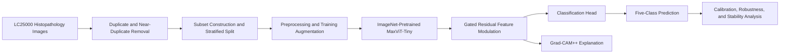

<div align="center">

# 🔬 Explainable MaxViT-Tiny-GRFM

## Histopathology Classification with Gated Residual Feature Modulation

<p>
  <strong>
    A research framework for lung and colon histopathology classification using an ImageNet-pretrained MaxViT-Tiny backbone, Gated Residual Feature Modulation, duplicate-aware dataset preparation, robustness analysis, calibration, and explainable AI.
  </strong>
</p>

<p>
  
  
  
  
  
  
  
</p>

<p>
  <b>Histopathology</b> •
  <b>MaxViT</b> •
  <b>Feature Modulation</b> •
  <b>Robustness</b> •
  <b>Calibration</b> •
  <b>Explainable AI</b>
</p>

</div>

> 📄 **Manuscript status:** The associated manuscript has been submitted to an academic conference and is currently **under review**. The results in this repository correspond to the submitted research work and should not be interpreted as a final published version.

> ⚠️ **Research disclaimer:** This repository is intended for research and educational purposes. It is not a medical diagnostic system and must not be used for clinical decision-making.

---

## 👨‍🔬 Overview

This repository contains the implementation and research materials for an explainable deep learning framework for classifying lung and colon histopathology images.

The proposed method, **MaxViT-Tiny-GRFM**, extends an ImageNet-pretrained MaxViT-Tiny model with a **Gated Residual Feature Modulation (GRFM)** module. The framework is designed to improve discriminative feature learning while preserving interpretability and evaluating model reliability beyond accuracy alone.

The research workflow covers:

- Duplicate-aware dataset preparation.
- Near-duplicate removal using perceptual hashing.
- Stratified train/validation/test splitting.
- Offline training augmentation.
- MaxViT-Tiny transfer learning.
- Gated residual feature modulation.
- Comparative evaluation against compact transformer baselines.
- Calibration and reliability analysis.
- Three-fold cross-validation.
- Multi-seed stability evaluation.
- Robustness testing under image corruptions.
- Grad-CAM++-based visual explanation.
- Computational efficiency analysis.

The complete submitted manuscript is available in [`Lung_histo.pdf`](./Lung_histo.pdf).

---

## ✨ Research Highlights

<table>
<tr>
<td width="50%">

### 🧠 Model Design

- ImageNet-pretrained MaxViT-Tiny.
- Gated Residual Feature Modulation.
- Residual refinement with adaptive gating.
- Five-class lung and colon classification.
- 224 × 224 input resolution.

</td>
<td width="50%">

### 🔬 Reliability Evaluation

- Unseen test-set evaluation.
- Three-fold cross-validation.
- Three-seed stability analysis.
- Calibration metrics and confidence intervals.
- Robustness under image corruptions.
- Grad-CAM++ explanations.

</td>
</tr>
</table>

---

## 🧠 Proposed Framework



### GRFM-enhanced MaxViT-Tiny

The proposed architecture uses a MaxViT-Tiny backbone to extract hierarchical visual features from histopathology images. The GRFM module then refines these representations using learnable gating and residual feature transformation before classification.

Conceptually, the feature refinement process can be represented as:

```text
Input Image
    ↓
MaxViT-Tiny Feature Extraction
    ↓
Feature Transformation
    ↓
Learnable Gated Residual Modulation
    ↓
Dropout and Classification Head
    ↓
Predicted Histopathology Class
```

The module is intended to improve the representation of diagnostically relevant tissue structures while retaining the original feature information through residual connections.

---

## 📚 Dataset: LC25000

The experiments use the **LC25000 Lung and Colon Histopathological Image Dataset**.

### Dataset source

[Kaggle — LC25000: Lung and Colon Histopathological Images](https://www.kaggle.com/datasets/javaidahmadwani/lc25000)

### Original class distribution

| Class | Description | Original Images | Cleaned Images | Selected Images |
|---|---|---:|---:|---:|
| `colon_aca` | Colon adenocarcinoma | 4,500 | 4,069 | 609 |
| `colon_n` | Non-malignant colon tissue | 4,500 | 4,060 | 609 |
| `lung_aca` | Lung adenocarcinoma | 4,500 | 3,979 | 595 |
| `lung_n` | Non-malignant lung tissue | 4,500 | 3,952 | 593 |
| `lung_scc` | Lung squamous cell carcinoma | 4,501 | 4,060 | 609 |
| **Total** | — | **22,501** | **20,050** | **3,007** |

The submitted study applies duplicate-aware processing before model training. The final selected subset contains **3,007 images**, with approximately equal representation across the five classes.

### Final dataset split

| Split | Images | Percentage |
|---|---:|---:|
| Training | 2,404 | 80% |
| Validation | 298 | 10% |
| Test | 305 | 10% |
| **Total** | **3,007** | **100%** |

### Dataset classes

- `colon_aca` — Colon adenocarcinoma.
- `colon_n` — Normal/non-malignant colon tissue.
- `lung_aca` — Lung adenocarcinoma.
- `lung_n` — Normal/non-malignant lung tissue.
- `lung_scc` — Lung squamous cell carcinoma.

### Data preparation

The dataset pipeline includes:

1. Downloading the original LC25000 dataset.
2. Detecting and removing duplicate or highly similar images.
3. Constructing a balanced selected subset.
4. Applying a stratified train/validation/test split.
5. Applying offline augmentation only to the training data.
6. Keeping validation and test images free from training augmentation.

---

## ⚙️ Preprocessing and Augmentation

### Preprocessing

| Setting | Configuration |
|---|---|
| Image resize | 224 × 224 |
| Color format | RGB |
| Normalization | ImageNet mean and standard deviation |
| Training augmentation | Offline augmentation on training images only |
| Validation/test augmentation | No training augmentation |

The preprocessing pipeline preserves the original tissue appearance while preparing images for transformer-based feature extraction.

### Training augmentation

The study uses randomly selected augmentation operations to increase training diversity, including:

- Horizontal and vertical flipping.
- Rotation.
- Zooming.
- Brightness adjustment.
- Gaussian noise.
- Color and spatial transformations.

The validation and test sets are not augmented during evaluation.

---

## 🧪 Training Configuration

All models were trained under the same optimization protocol for a fair comparison.

| Setting | Configuration |
|---|---|
| Input size | 224 × 224 pixels |
| Number of classes | 5 |
| Weight initialization | ImageNet-pretrained weights |
| Fine-tuning strategy | Full-network fine-tuning |
| Maximum epochs | 35 |
| Batch size | 16 |
| Data-loader workers | 2 |
| Optimizer | AdamW |
| Learning rate | 2 × 10⁻⁵ |
| Weight decay | 1 × 10⁻⁴ |
| Loss function | Cross-Entropy with label smoothing = 0.10 |
| Gradient clipping | Maximum norm = 1.0 |
| Scheduler | ReduceLROnPlateau |
| Scheduler factor | 0.5 |
| Scheduler patience | 2 epochs |
| Minimum learning rate | 1 × 10⁻⁷ |
| Early stopping patience | 7 epochs |
| Mixed precision | Enabled with CUDA |
| Checkpoint criterion | Best validation macro F1-score |

---

## 🏆 Main Results

Evaluation was conducted on the unseen test set containing **305 images**.

| Model | Accuracy | Precision | Recall | F1-score |
|---|---:|---:|---:|---:|
| Swin-Tiny | 0.8131 | 0.8123 | 0.8131 | 0.8111 |
| DeiT-Tiny | 0.9311 | 0.9347 | 0.9310 | 0.9318 |
| MaxViT | 0.9707 | 0.9791 | 0.9768 | 0.9770 |
| **Proposed MaxViT-Tiny-GRFM** | **0.9967** | **0.9968** | **0.9968** | **0.9967** |

The proposed model correctly classified **304 out of 305** test images and achieved a test accuracy of approximately **99.67%**.

### Reliability and calibration

| Metric | Value |
|---|---:|
| MCC | 0.9959 |
| Cohen's Kappa | 0.9959 |
| Macro Sensitivity | 0.9968 |
| Macro Specificity | 0.9992 |
| Brier Score | 0.0064 |
| ECE | 0.0032 |
| Accuracy 95% CI | [0.9982, 1.0000] |
| Macro F1 95% CI | [0.9898, 1.0000] |

These results indicate strong discrimination and well-calibrated predictive probabilities on the evaluated test set.

---

## 🔁 Cross-Validation and Stability

### Three-fold cross-validation

| Fold | Accuracy | Macro F1 |
|---|---:|---:|
| 1 | 0.9971 | 0.9971 |
| 2 | 0.9983 | 0.9983 |
| 3 | 0.9983 | 0.9983 |
| **Mean ± SD** | **0.9979 ± 0.0007** | **0.9979 ± 0.0007** |

### Three-seed evaluation

| Seed | Accuracy | Macro F1 |
|---|---:|---:|
| 42 | 1.0000 | 1.0000 |
| 123 | 1.0000 | 1.0000 |
| 2024 | 0.9902 | 0.9902 |
| **Mean ± SD** | **0.9967 ± 0.0057** | **0.9967 ± 0.0057** |

The cross-validation and multi-seed experiments indicate stable performance, although the seed-based results also show that reproducibility should be considered when interpreting very high test scores.

---

## 🧩 Confusion Matrix and Class-wise Analysis

The test-set confusion matrix shows that the proposed model correctly classified examples from all five histopathology classes. The reported error occurred between visually similar normal and malignant tissue categories, demonstrating the importance of class-wise evaluation in addition to aggregate accuracy.

The repository includes the original manuscript figures and detailed class-wise analysis in [`Lung_histo.pdf`](./Lung_histo.pdf).

---

## 📈 Precision–Recall and ROC-AUC Analysis

The proposed model achieved strong class-wise precision–recall behavior across all five categories. The one-vs-rest ROC-AUC analysis reported an overall macro ROC-AUC of approximately **1.0000**, indicating excellent ranking performance on the evaluated test set.

These results should be interpreted together with the independent test split, cross-validation results, calibration analysis, and external validation when assessing generalization.

---

## 🛡️ Robustness under Image Corruptions

The model was evaluated under multiple image corruption types to assess the stability of predictions under perturbations.

| Corruption | Mean Accuracy | Worst Accuracy |
|---|---:|---:|
| Gaussian noise | 0.8715 | 0.7639 |
| Salt-and-pepper noise | 0.9370 | 0.8361 |
| Speckle noise | 0.8505 | 0.7738 |
| Gaussian blur | 0.8708 | 0.6393 |
| Motion blur | 0.8977 | 0.7508 |
| Darkening | 0.9954 | 0.9902 |
| Brightening | 0.9161 | 0.7934 |
| Reduced contrast | 0.9836 | 0.9410 |
| JPEG compression | 0.9384 | 0.8000 |
| Occlusion | 0.9961 | 0.9934 |

The results show strong performance under darkening, occlusion, reduced contrast, and JPEG compression, while stronger noise and blur perturbations cause a larger performance drop.

---

## 🔍 Explainable AI

The framework uses **Grad-CAM++** and related visual explanation methods to identify image regions that influence the model’s predictions.

The explanations are used to investigate whether the model focuses on meaningful histopathological structures such as:

- Cellular clusters.
- Glandular structures.
- Nuclear regions.
- Tissue boundaries.
- Morphological patterns associated with malignancy.

The visual explanations in the manuscript show the original histopathology image, the backbone activation map, the GRFM-refined feature map, Grad-CAM++ visualization, and a gradient-based saliency map.

> Explainability maps describe model behavior and provide interpretive evidence; they do not constitute clinical proof or diagnostic evidence.

---

## ⚡ Computational Characteristics

| Measure | Value |
|---|---:|
| Trainable parameters | 31,458,381 |
| Estimated parameter size | 120.29 MB |
| Estimated MACs | 5.33 GMACs |
| Estimated FLOPs | 10.67 GFLOPs |
| Training time | Approximately 35.45 minutes |
| Batch size | 16 |
| End-to-end inference latency | Approximately 4.24 ms/image |
| End-to-end throughput | Approximately 235.89 images/second |

The proposed model provides a practical balance between classification performance and computational cost for research-oriented histopathology image analysis.

---

## 🧪 GRFM Ablation Analysis

An ablation study was conducted by removing the Gated Residual Feature Modulation module from the MaxViT-Tiny architecture.

| Variant | Accuracy | Macro F1 |
|---|---:|---:|
| MaxViT-Tiny without GRFM | 0.9738 | 0.9736 |
| **MaxViT-Tiny with GRFM** | **0.9967** | **0.9967** |

The addition of GRFM improved accuracy by approximately **2.29 percentage points** and macro F1-score by approximately **2.31 percentage points** compared with the corresponding model without GRFM.

This supports the contribution of gated residual feature modulation for refining transformer representations in histopathology classification.

---

## 🆚 Baseline Models

The submitted study compares the proposed framework with compact transformer-based models, including:

- Swin-Tiny.
- DeiT-Tiny.
- MaxViT.

All baseline models were evaluated using the same dataset split, training protocol, and evaluation settings to support a fair comparison.

---

## 📁 Repository Structure

```text
Histopathology-Classification/
├── Lung_histo.pdf
├── pmvdcode.ipynb
├── pmvdcode (1).ipynb
└── README.md
```

### Notebook contents

The notebooks contain the experimental workflow, including:

- Dataset loading.
- Duplicate and near-duplicate analysis.
- Dataset subset construction.
- Image preprocessing.
- Training augmentation.
- MaxViT-Tiny and GRFM model training.
- Baseline comparison.
- Test-set evaluation.
- Calibration and reliability analysis.
- Cross-validation.
- Multi-seed evaluation.
- Robustness testing.
- Grad-CAM++ explainability.

---

## 🚀 Quick Start

### 1. Clone the repository

```bash
git clone https://github.com/Ashikuzzaman026/Histopathology-Classification.git
cd Histopathology-Classification
```

### 2. Create a virtual environment

```bash
python -m venv .venv
```

Linux/macOS:

```bash
source .venv/bin/activate
```

Windows:

```bash
.venv\Scripts\activate
```

### 3. Install the core dependencies

```bash
pip install torch torchvision timm numpy pandas scipy scikit-learn matplotlib tqdm pillow opencv-python scikit-image
```

### 4. Download the dataset

Download LC25000 from Kaggle:

```text
https://www.kaggle.com/datasets/javaidahmadwani/lc25000
```

Place the extracted class folders in the location expected by the notebook configuration.

### 5. Run the notebooks

Open one of the notebooks in Jupyter or Google Colab:

```text
pmvdcode.ipynb
pmvdcode (1).ipynb
```

Recommended workflow:

```text
Dataset Download
      ↓
Duplicate and Near-Duplicate Removal
      ↓
Subset Construction
      ↓
Preprocessing and Augmentation
      ↓
Train / Validation / Test Split
      ↓
MaxViT-Tiny-GRFM Training
      ↓
Baseline Comparison
      ↓
Independent Test Evaluation
      ↓
Calibration and Reliability Analysis
      ↓
Cross-Validation and Multi-Seed Testing
      ↓
Robustness Evaluation
      ↓
Grad-CAM++ Explainability
```

---

## 📄 Manuscript

The submitted manuscript is included in this repository:

- [`Lung_histo.pdf`](./Lung_histo.pdf)

The manuscript contains the detailed methodology, literature review, dataset preparation, architecture diagrams, experimental results, robustness analysis, explainability figures, comparison with existing studies, limitations, and future work.

---

## ⚠️ Limitations

- The experiments are based on the LC25000 dataset and a selected duplicate-aware subset.
- Very high performance on a curated dataset may not directly translate to clinical settings.
- Histopathology images may vary across laboratories, scanners, staining protocols, and magnification levels.
- The model may learn dataset-specific patterns or artifacts.
- Grad-CAM++ visualizations do not establish clinical validity.
- Independent external validation on additional histopathology datasets is required.
- The associated paper is currently under review, so the research claims may be revised after peer review.

---

## 🔮 Future Work

Potential future directions include:

- External validation on independent histopathology datasets.
- Multi-center and multi-scanner evaluation.
- Stain normalization and domain adaptation.
- Prospective clinical validation.
- More detailed uncertainty quantification.
- Structured expert assessment of explanation maps.
- Lightweight deployment for pathology-support systems.
- Evaluation on whole-slide images and multi-scale tissue regions.

---

## 📚 Citation and Attribution

Please cite the LC25000 dataset according to the original dataset source and follow its licensing and attribution requirements:

[LC25000 Dataset on Kaggle](https://www.kaggle.com/datasets/javaidahmadwani/lc25000)

If you use this repository or the associated research, please cite the manuscript when it becomes publicly available.

```bibtex
@misc{histopathology_maxvit_tiny_grfm,
  title  = {An Explainable MaxViT Framework with Gated Residual Feature Modulation for Histopathology Classification},
  author = {Ashikuzzaman026},
  year   = {2026},
  note   = {Manuscript under review},
  url    = {https://github.com/Ashikuzzaman026/Histopathology-Classification}
}
```

---

## 🤝 Contributing

Suggestions and research-oriented improvements are welcome.

1. Fork the repository.
2. Create a feature branch.
3. Add or improve experiments, documentation, or analysis.
4. Verify that changes are reproducible.
5. Open a pull request.

---

## 👤 Author

**Ashikuzzaman026**

GitHub: [@Ashikuzzaman026](https://github.com/Ashikuzzaman026)

---

## 📜 License

No software license has been specified yet. Add an appropriate license before redistributing the code. The repository license and the LC25000 dataset license may be different; review both separately before commercial or public redistribution.
